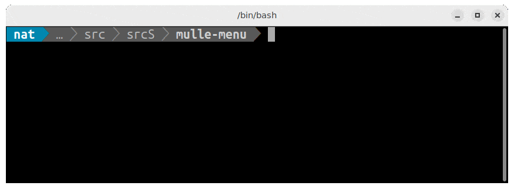

# 🍟 A menu for your bash scripts

... for Android, BSDs, Linux, macOS, SunOS, Windows (MinGW, WSL)

Presents a menu for the user to pick an option from. A nice feature to add
to your shell scripts, that need some interaction with the user.




## Usage

```
Usage:
   mulle-menu [flags] <menu-option> ...

   Present a menu on the command line at the current cursor position. The
   user can then use cursor keys or 'j' 'k' and ENTER to make a selection.
   The user can press ESC or 'q' to quit the menu. SIGINT (CTRL-C) is also
   intercepted and treated as a special form of quitting.

   The menu will return immediately, if only a single option is given.

   Do not use redirection when calling mulle-menu. So do not use '<' or '>' on
   stdin/stdout or use calls like  $(mulle-menu ...)

Example:
      mulle-menu VfL Bochum 1848
Your options are:
> VfL
  Bochum
  1848

Return code:
   0-127  : index of the chosen option
   -1/128 : user opted out, did not choose anything
   -2/129 : user pressed CTRL-C
   -3/130 : EOF encountred
   -4/131 : options are empty
   -5/132 : too many options (128 max)

Flags:
   --final-title <s>      : set string for final result output ("" to suppress)
   --no-ctrl-c            : do not trap CTRL-C, this disables polling
   --prefix <c>           : set prefix for unselected options
   --selection-prefix <c> : set prefix for selected options
   --sv-rc                : trust tput sv/rc, which seems to be broken often
   --title <s>            : set string for initial prompt ("" to suppress)
   -n                     : dry run
   -s                     : be silent
   -v                     : be verbose (increase with -vv, -vvv)
      (use -v flag to see more options)

```


## Install

See [mulle-sde-developer](//github.com/mulle-sde/mulle-sde-developer) how to
install mulle-sde, which will also install mulle-menu with required
dependencies.

The command to install only the latest mulle-menu into
`/usr/local` (with **sudo**) is:

``` bash
curl -L 'https://github.com/mulle-sde/mulle-menu/archive/latest.tar.gz' \
 | tar xfz - && cd 'mulle-menu-latest' && sudo ./bin/installer /usr/local
```


## Author

[Nat!](https://mulle-kybernetik.com/weblog) for Mulle kybernetiK


